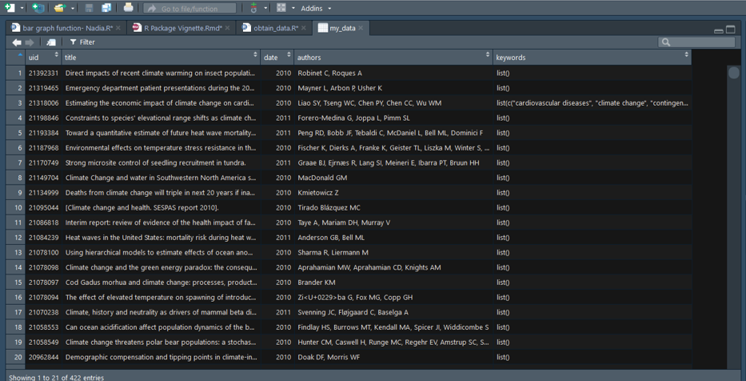
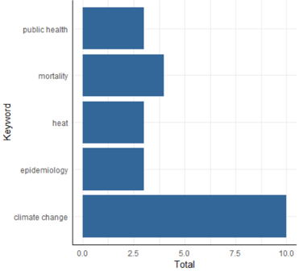
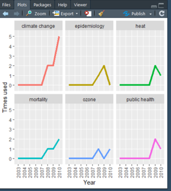

Team Rosetta Stone 4.0 
Frank DeVone, Blake Hansen, Nadia Mercado, Kira Raskina 

Due: December 16, 2018 

```{r, echo = FALSE, message = FALSE}
knitr::opts_chunk$set(collapse = T, comment = "#>") #check formatting and delete if needed
options(tibble.print_min = 4L, tibble.print_max = 4L) #check formatting and delete if needed
#Required packages

names<-c("dplyr","tidyr","rentrez","stringr","rvest","ggplot2","rebus")


for(name in names){
        if (!(name %in% installed.packages())){
           # install.packages(name, repos="http://cran.us.r-project.org",quiet=TRUE,dependencies=TRUE) #if package not installed, install the package
        print("here")
    	 install.packages(name, repos="http://cran.us.r-project.org",quiet=TRUE,dependencies=FALSE)} #if package not installed, install the package
        library(name, character.only=TRUE,warn.conflicts=FALSE,quietly=TRUE)
  
}


#library(dplyr)
#library(tidyr)
#library(rentrez)
#library(stringr) 
#library(rvest)
#library(ggplot2)
#library(rebus)
```

###Introduction to pubkey 

Before starting any research project, some people might find it useful to know certain key information. These hopeful scientists may want to have a quick glance and see what trends are becoming more popular or losing popularity in their field of choice prior to writing a grant application. Others, may be Masters or PhD graduate students that may want to know if their thesis or disertation projects will be useful in the years to come. PubMed can be helpful for answering these questions but it may not be the most efficient. 

The pubkey package can be an excellent starting point to answer these questions: 

* By gathering the keywords in a search query on PubMed, users can easily track which keywords are most popular for a given a search query

* It can quickly and efficently let users know which keywords are most used overall and by year

* It allows users to visualize keyword trends from a PubMed query to illustrate these trends that is convenient and easy to analyze

This document will introduce pubkey's available user functions, and will demonstrate how quick and easy it is to use these functions for any query. 

## Example Query: Trends in Public Health and Climate Change

To explore the different functions available in pubkey, we'll be using the terms **"public health"** and **"climate change"** as our query and analyze the trends in research using the keywords found on PubMed.

## Functions in pubkey

Pubkey aims to provide each function with a purpose that will assist with analyzing key trends in any given search query in PubMed. 

* `key_estimate_time()` estimates the time to download their query data frame 

* `key_download()` generates a data frame with articles generated from the search query with key words

* `key_summary()` generates a data frame with each individual keyword with the freqency by year and total

* `key_bgraph()` generates a ggplot2 bar graph using the dataframe in `key_summary()` 

* `key_lgraph()` generates a ggplot2 line graph with individual facets for each keyword using the dataframe in `key_summary()`


##Estimate download time for each query with `key_estimate_time()` 

`key_estimate_time()` allows the user to quickly see an estimated time on how long their query would take to download using our R package.

```{r, eval=FALSE}
key_estimate_time("public health AND climate change")
```

Where the output will look like this: 
```{r, eval=FALSE}
[1] "Search returned 15140 articles. We estimate that your download will take approximatley 188 minutes to complete. Please consider using the advanced search option at https://www.ncbi.nlm.nih.gov/pubmed/advanced to create a more concise search."
```

Hmmm, this might take a lot longer than we would want it to. Let's try to limit our results by adding the search term **"survival"** and limit the years from 2000-2010. 

```{r, eval=FALSE}
key_estimate_time("public health AND climate change AND survival AND 2000:2010[PDAT]")
```

Now the output will look like this: 
```{r, eval=FALSE}
[1] "Search returned 423 articles. We estimate that your download will take approximatley 5 minutes to complete."
```

That's a lot better! We highly suggest that our users take advantage of this function to see if they want to do a broad search or help tailor their query if they are looking for something more specific.  

##Gather keywords from articles in a PubMed query using `key_download()`

`key_download()` creates a data frame with the PMID, title, date published, authors, and keywords for the articles matching the query provided. Using our previous query: 

```{r, eval=FALSE}
my_data <- key_download("public health AND climate change AND survival AND 2000:2010[PDAT]", full_search = T)
```

The sample output will look something like is this: 


A few important points to note here: 

* Save the command to a variable in order to be able to see the results and use our other functions.

* Not every article will have keywords (in fact, the majority of articles will not).

* We have included a default argument, 'full_search = FALSE'. This is a default threshold where the query will only pull from the first 360 articles to make the function faster and should only be used if the user wants a rough estimate of the keywords in a certain query. If the user wants to have all the possible articles that result from a query, set the argument to 'full_search = TRUE'. 

* The results do not return a user-friendly table, but we have another function that can help with that!

##Generate a quick and easy-to-read table using `key_summary()`

`key_summary()` creates a user-friendly table with each of the keywords resulting from the query and lists the count for each by year and the total. It is important to note that the user must run the function `key_download()` first and save the resulting data frame in order to use `key_summary()`.

```{r, eval = FALSE}
climate_table <- key_summary(my_data)
```

The results should generate a table that looks like this: 


Much better and easier to read right? For fun, the pubkey R package also includes built-in functions to visualize these results This table is makes the information easier to digest and may be useful to the user. 

##Generate a simple bar graph to analyze keywords using `key_bgraph()`

Besides analyzing the data frame generated using `key_summary()`, the user may also only be interested in seeing the top 5 keywords for their query. `key_bgraph()` is a quick function that will help the user do this: 

```{r, eval=FALSE}
key_bgraph(Full_table, 5)
```

Where the output should look roughly like this:




Here are a few helpful tips for using the `key_bgraph()` function: 

* The user must run the function `key_summary()` first and save the resulting data frame prior to using the `key_bgraph()` function.

* Try to limit the number of keyterms to less than 30, any more and the table will look a little clustered and lose its utility.

* The default number of keywords that will be graphed is 10, the user must specify the number of keywords if this number desired is different.

##Generate a line graph to analyze keyword trends with `key_lgraph()`

`key_lgraph()` allows the user to efficiently check how keyword trends changed over time by creating line graphs with facets.

```{r, eval=FALSE}
key_lgraph(climate_table, 6)
```



We can quickly see that the keywords **"climate change"** and **"mortality"** are on the rise in public health research articles related to climate change. 

Here are a few helpful tips for using the `key_lgraph()` function: 

* Similar to the `key_bgraph()` function, the user must run the function `key_summary()` first and save the resulting data frame prior to using `key_lgraph()`. 

* Unlike the `key_bgraph()` function, there is no recommended limit to the number of key terms a user should plot, however, the line graphs may become clustered and diffucult to read if the user has a significant number of years in the search or plots a significant number of keywords.

* The default number of keywords that will be graphed is 10, the user must specify the number of keywords if this number desired is different.

##Comparisons and Concluding Thoughts

The pubkey package is an extension of the exisiting [rentrez package](https://cran.r-project.org/web/packages/rentrez/index.html) available in CRAN. Currently, rentrez is only able to grab values and information stored in PubMed's search options (number of records in the database, PMID, article title, authors, ect.). However, rentrez is unable to pick out details listed for each indivdual object outside of the search results. Our R package, pubkey, is an exercise if being able to webscrape data beyond PubMed's search results and turn this information into an easily digestable table with corresponding visual graphs.    
